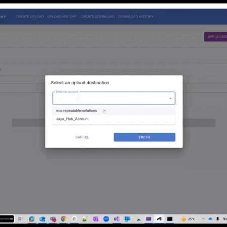

# Disclaimer
 This repository serves as a provisional solution, and we plan to unveil an official Autodesk repository very soon. However, you can use this temporary solution to meet your immediate needs in the meantime.
 
# Bulk File Uploader

### Application Overview
This is a desktop-based tool for uploading the files from a local windows machine to a folder in BIM 360 or ACC. 
Also we can downloaded the files from ACC to local drives in quicker manner.

### Thumbnail

### Pre-requisites
1.	.NET 6 Runtime 
2.	Webview2 Evergreen Runtime 
3.	An APS application Client ID and Secret with Data Management permissions, that has been added to the relevant BIM 360 or ACC Account, and with a callback URL of http://localhost:8083/code.
4.	Install Node.Js along with npm then validate the versions.
5.	Also configure your client-id in the BIM 360 account hubs to uploads /download the documents.

### Development
This application uses WinForms with a Webview2 interface. This means that the user interface is served using a 
Chromium browser, with an ASP.NET backend. 

#### Communication between UI and Backend

There are two ways to communicate between the host and the UI:
* REST calls
  * Standard ASP.net controllers may be used to send messages from the UI to the backend.
* PostMessage
  * The UI is able to send messages to the backend using `window.chrome.webview.postMessage(YOUR_MESSAGE_HERE)`.
    It is then processed by the `WebMessageReceived()` method in `Bulk-Uploader-FrontEnd/Views/MainForm.cs`.
  * The backend is able to respond using `this.webView21.CoreWebView2.PostWebMessageAsString(YOUR_MESSAGE_HERE)`. It 
    is then processed by the UI using `window.chrome.webview.addEventListener('message', event=>{ alert(event.data) })` 
    in `Bulk-Uploader-FrontEnd/ClientApp/src/App.tsx`.
  * This has been simplified on the front end with the `useMessageListener(messagename)` hook.

#### React Notes

When using `<NavLink/>` to go between the SPA and other pages (such as the hangfire dashboard), you must use the 
`reloadDocument` parameter to force React Router to treat it as a normal `<a href="...">` element. 

#### Database

This application uses Entity Framework. If you make any changes to the data structures, you'll need to run the 
following command from the `Bulk-Uploader-FrontEnd` folder: `dotnet ef migrations add NameOfYourMigrationHere --project "..\ApsSettings.Data\ApsSettings.Data.csproj"`

#### Technology Stack
* WinForms
* Webview2
* Entity Framework
* SQLite database
* Hangfire
* .NET Standard 2.1
* .NET 6.0

### Features 
* Upload documents
*	Upload documents history
*	Download document
*	Download document history
*	Hangfire Dashboard
*	Utilities 

### Usage
1.	Clone the repo into local drive
2.	Restro/re-build the application to updated all packages(it will also install npm packages).
3.	Run the application it will launch the desktop viewer.
4.	Authenticate using a Client ID and Secret to upload files into the specific project.
5.	To Generate client id & client secret please register into APS Services.
6.  Follow the [User Guide](:Documentation/user-guide.md) for more information.
 

### Contributing
In order to clarify the intellectual property license granted with Contributions from any person or entity, 
Autodesk must have a Contributor License Agreement ("CLA") on file that has been signed by each Contributor to 
this Open Source Project (the “Project”), indicating agreement to the license terms.
This license is for your protection as a Contributor to the Project as well as the protection of Autodesk and 
the other Project users; it does not change your rights to use your own Contributions for any other purpose. 
There is no need to fill out the agreement until you actually have a contribution ready. Once you have a 
contribution you simply fill out and sign the applicable agreement (see the contributor folder in the repository) 
and send it to us at the address in the agreement.

### Tips & Tricks
Bulk Uploader application is having customizable option for endpoints configurations, user can modify the endpoints values in `Appsettings.cs` file. 
Currently we have prepoulated with default vaules, please change if it requires.

### Contact
* Daniel Clayson <daniel.clayson@autodesk.com>
* Jayakrishna Kondapu <jayakrishna.k@autodesk.com>

### Legal
Copyright (c) Autodesk

